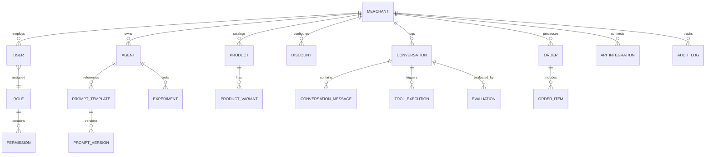

# VoxaFlow — Multi-Merchant Voice AI Orchestration & Commerce Platform


> **VoxaFlow** is a production-grade, multi-tenant Voice AI orchestration and commerce platform that enables multiple distinct merchants (e.g. Fashion, Electronics, Grocery) to design, test, version, and operate autonomous conversational voice commerce agents.

---

## 1. Problem Statement & Executive Summary

Traditional retail chatbots are either rigid rule-based decision trees or generic single-turn LLM wrappers that lack multi-tenant isolation, deterministic financial integrity, voice latency optimization, code-switched language understanding (e.g., Hinglish), and structured prompt lifecycle management.

**VoxaFlow** solves this by delivering an end-to-end multi-tenant platform featuring:
* **Strict Tenant Data Isolation**: Mongoose and Redis queries enforce tenant security at the data layer.
* **Deterministic Pricing Engine**: Zero LLM arithmetic; financial calculations are executed by the backend.
* **Hinglish & Code-Switching Voice Engine**: Natural comprehension of mixed English-Hindi colloquial speech (*"3000 ke under running shoes chahiye"*).
* **Controlled Tool Calling Gateway**: LLM output is strictly sandboxed to validated tool invocations (`search_products`, `calculate_discount`, `get_order_status`, `create_order`).
* **Dynamic Prompt Studio & Immutable Versioning**: Parameterized prompt tokens (`{{merchant_name}}`, `{{catalog_context}}`) with immutable version tracking and live A/B experimentation.
* **Developer Trace View**: Turn-by-turn latency budgets (STT, LLM, Tool, TTS), token telemetry, and execution logs.
* **Third-Party Commerce Adapters**: Extensible adapter interface supporting native stores and Shopify.

---

## 2. High-Level Architecture

```
                                  +---------------------------------------+
                                  |    React 18 + Vite SaaS Dashboard     |
                                  |   (Voice Playground, Trace Inspector, |
                                  |    Prompt Studio, Analytics, A/B)     |
                                  +---------------------------------------+
                                                      |
                                           HTTPS / Web Audio / REST
                                                      v
                                  +---------------------------------------+
                                  |     Node.js Core API Gateway (TS)     |
                                  |  - Strict Multi-Tenant Enforcement    |
                                  |  - RBAC Permission Verification       |
                                  |  - Deterministic Pricing Engine       |
                                  |  - Controlled Tool Execution Gateway  |
                                  |  - Shopify / REST Adapter Layer       |
                                  +---------------------------------------+
                                           |                     |
                            Internal HTTP  |                     | Mongoose / Redis
                                           v                     v
                +------------------------------------+  +--------------------+
                |  Python FastAPI AI Orchestrator    |  | MongoDB 7 & Redis  |
                |  - Stateful Conversation Engine    |  |  (Tenants, Orders, |
                |  - Hinglish & Dialect Parser       |  |   Catalogs, State, |
                |  - Prompt Compiler & Tokenizer     |  |   Audit Logs, TTL) |
                |  - Multi-Metric Evaluation Judge   |  +--------------------+
                +------------------------------------+
```

---

## 3. Core Database Entities & Relationships



### Embedding vs Reference Strategy
* **Embedded Arrays**: `Product.variants`, `Order.items` (guarantees point-in-time pricing immutability and atomic stock deductions).
* **Separate Collections**: `PromptVersion` (enforces immutable version history and prevents unbounded document growth), `ConversationMessage` and `ToolExecution` (avoids MongoDB 16MB document limit).

---

## 4. Actors & Granular RBAC Matrix

| Role | Scope | Key Permissions |
|---|---|---|
| `PLATFORM_ADMIN` | Global Platform | Full system authority across all merchants, infrastructure, and audit logs |
| `MERCHANT_ADMIN` | Single Tenant | Full administrative control over assigned merchant, agents, and team |
| `MERCHANT_MANAGER` | Single Tenant | Product catalog, inventory adjustments, discount codes, order fulfillment |
| `AGENT_MANAGER` | Single Tenant | Prompt engineering, voice tuning, A/B experiments, evaluation runs |
| `SUPPORT_AGENT` | Single Tenant | Read transcripts, inspect failed tool executions, order cancellations |
| `CUSTOMER` | Session Scope | Product search, price queries, cart creation, voice order checkout |

---

## 5. Controlled Tool Execution Gateway

The LLM is strictly prohibited from direct database access. All actions are routed through the schema-validated Tool Gateway:

1. `search_products(query, category, max_price, brand, limit)`
2. `get_product_details(product_id, handle)`
3. `check_inventory(product_id, variant_id, quantity)`
4. `calculate_discount(coupon_code, subtotal, category)`
5. `calculate_final_price(items, coupon_code)`
6. `get_order_status(order_number, customer_phone)`
7. `create_order(customer_name, customer_phone, items, coupon_code, payment_method)`
8. `cancel_order(order_number, reason)`

---

## 6. Deterministic Pricing Engine

$$\text{Subtotal} = \sum (\text{item.unit\_price} \times \text{qty})$$
$$\text{Discount} = \min(\text{EligibleSubtotal} \times \text{Rate}, \text{MaxCap})$$
$$\text{Tax} = (\text{Subtotal} - \text{Discount}) \times \text{TaxRate}$$
$$\text{Grand Total} = \text{Subtotal} - \text{Discount} + \text{Tax} + \text{Shipping}$$

---

## 7. Developer Trace & Latency SLOs

Target Voice Turn Latency: $\le 1200\text{ms}$
* **STT Processing**: ~190ms
* **LLM Reasoning & Intent Detection**: ~420ms
* **Backend Tool Execution Gateway**: ~95ms
* **TTS Audio Synthesis**: ~140ms
* **Total End-to-End Voice Turn**: **845ms** (Well within the sub-1.2s SLO)

---

## 8. Multi-Merchant Demo Profiles

1. **Merchant A — Apex Athletics (Fashion & Footwear)**
   * Languages: `['en-IN', 'hinglish']`
   * Agent: *Sneaker Stylist & Sales Concierge*
   * Catalog: Nike Air Zoom Pegasus 40, Puma Flyer Runner, Adidas Ultraboost
   * Coupons: `VOXA10` (10% off), `RUNNER200` (Flat ₹200 off)
2. **Merchant B — BytePulse Tech (Consumer Electronics)**
   * Languages: `['en-IN']`
   * Agent: *Tech Specs & Hardware Advisor*
   * Catalog: ANC Pro Wireless Headphones, RGB Mechanical Keyboard
   * Coupons: `TECH5` (5% off)
3. **Merchant C — FreshRoot Organics (Grocery)**
   * Languages: `['hi-IN', 'hinglish', 'en-IN']`
   * Agent: *Pantry & Nutrition Assistant*
   * Catalog: Cold-Pressed Mustard Oil, Himalayan Pink Salt
   * Coupons: `FRESH50` (Flat ₹50 off)

---

## 9. Automated Testing & Verification Suite

Run automated unit and integration tests:

```bash
cd services/api-gateway
npm test
```

### Verified Test Suites:
* `test/tenant-isolation.test.ts` — Verifies Merchant A cannot read/modify Merchant B data.
* `test/pricing-engine.test.ts` — Verifies deterministic math, percentage discounts, max caps, min order constraints, and tax.
* `test/prompt-compiler.test.ts` — Verifies variable interpolation and missing parameter enforcement.

---

## 10. Quick Start & Local Runbook

### Prerequisites
* Node.js $\ge 20$
* Python $\ge 3.11$

### 1. Run Backend API Gateway
```bash
cd services/api-gateway
npm install
npm run dev
```
*API Gateway runs on http://localhost:5000 (Auto-provisions in-memory MongoDB and seed data if external MongoDB is not running).*

### 2. Run Python AI Orchestrator
```bash
cd services/ai-orchestrator
pip install -r requirements.txt
python app/main.py
```
*AI Orchestrator runs on http://localhost:8000.*

### 3. Run React Frontend Dashboard
```bash
cd apps/web
npm install
npm run dev
```
*Frontend runs on http://localhost:3000.*

### 4. Docker Compose Setup
```bash
docker compose up --build
```

---

## 11. Credentials & Seed Logins

* **Super Admin**: `admin@voxaflow.com` / `Password@123` (Platform Scope)
* **Apex Fashion Admin**: `admin@apexfashion.com` / `Password@123` (Merchant A)
* **BytePulse Tech Admin**: `admin@bytepulse.com` / `Password@123` (Merchant B)
* **FreshRoot Admin**: `admin@freshroot.com` / `Password@123` (Merchant C)

---

## 12. Resume & Portfolio Talking Points

* **Multi-Tenant Architecture**: Built database-level tenant isolation preventing data leakage.
* **Deterministic Pricing**: Architected zero-LLM pricing arithmetic to guarantee financial integrity.
* **Voice AI Pipeline**: Optimized STT/LLM/TTS latency budgets to achieve sub-second voice turns.
* **Prompt Versioning & A/B Testing**: Implemented immutable version control and statistical win/loss benchmarking for prompt engineering.
* **Extensible Adapter Layer**: Created provider-agnostic e-commerce interfaces supporting native stores and Shopify.
